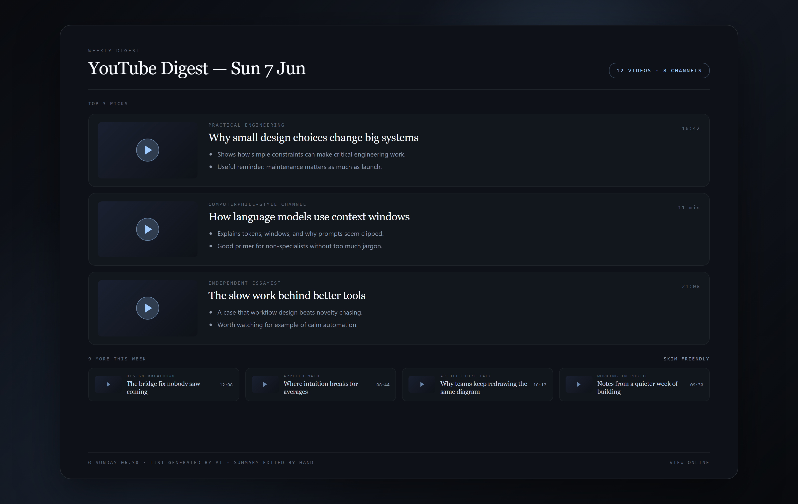
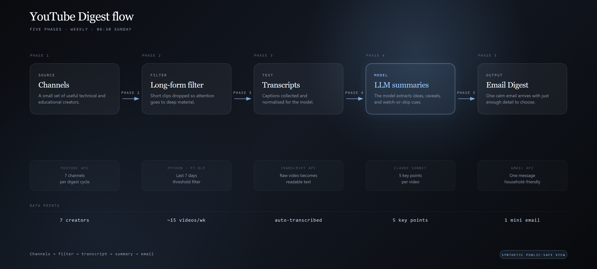

# AI YouTube Digest

A simple weekly email that tells my wife and me which YouTube videos are actually worth our time, so we stop scrolling and start watching the good ones.

## Why I built it

My wife follows a handful of channels but never has time to check which ones posted something good. The videos pile up, and choosing what to watch becomes its own little chore.

So I built a small automation that does the checking for us. Once a week it looks at our favourite channels, finds the new long-form videos, reads what each one is about, and sends a short, clean email with the highlights. We open one email instead of digging through YouTube.

## What it does

- Checks a list of favourite YouTube channels for recent long-form videos.
- Pulls the captions so it knows what each video is actually about.
- Summarises every video into three short, useful bullet points.
- Builds a clean email with thumbnails and direct links.
- Sends the digest on a weekly schedule.

## Screenshots and workflow

The weekly email, using demo content.

The flow: check channels, get captions, summarise, build the email, send it.

## How it works

The automation runs on a schedule. It keeps a short list of channels, finds the latest videos, and uses AI to turn each one into three plain bullet points. Those summaries are placed into a tidy email layout with thumbnails and links, then sent. Nothing needs to be checked by hand.

## Privacy

This public repo uses demo content only. Our real channel list, email address, and send history stay private and are not included here.

## Built with AI assistance

I'm not a software developer. I had the idea, decided how the email should read, and used AI tools to help build and refine it. The point of this project is taking a small everyday annoyance and turning it into something that quietly saves us time every week.

## Related

- Portfolio: https://www.mikhailnarbekov.com
- Medium story: [Proving AI's value to my wife: I built a weekly YouTube digest](https://medium.com/@mikhail.narbekov/proving-ais-value-to-my-wife-i-built-a-weekly-youtube-digest-d3a797b9f69b)
- GitHub: https://github.com/Mnarbekov
